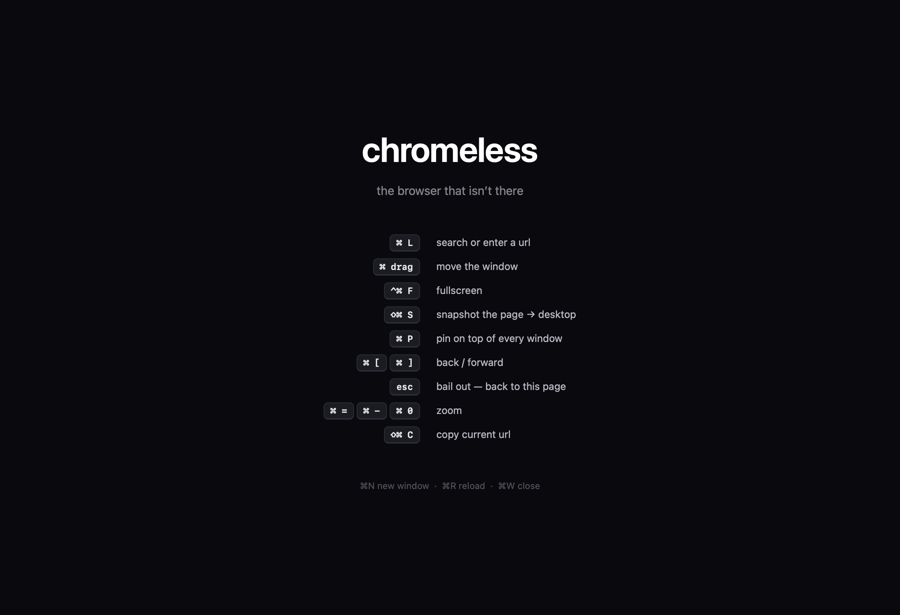

# chromeless

**The browser that isn't there.** The window *is* the webpage — no toolbar, no address bar, and no tab bar until you ask for a second tab. Made for clean screenshots, fullscreen YouTube, dashboards, and anything else that deserves the whole window.

A native macOS app in one Swift file, built on WKWebView (the Safari engine). No Electron, no dependencies, ~630 KB built.



## Build

```sh
./build.sh        # -> Chromeless.app
open Chromeless.app

# or run the binary directly
./Chromeless.app/Contents/MacOS/Chromeless
```

Requires the Xcode Command Line Tools (`xcode-select --install`). Optionally `mv Chromeless.app /Applications/`.

## Use

Everything is a keystroke (also listed on the start page and in the menu bar):

| Keys | Action |
| --- | --- |
| `⌘L` | Search or enter a URL (floating HUD) |
| `⌘drag` | Move the window from anywhere |
| `⌃⌘F` | Fullscreen (YouTube's own ⛶ button works too) |
| `⇧⌘S` | Snapshot the page as PNG → Desktop |
| `⌘P` | Pin the window above everything |
| `⌘[` / `⌘]` | Back / forward (two-finger swipe also works) |
| `⇧⌘H` | Home — back to the start page |
| `⌘=` `⌘-` `⌘0` | Zoom in / out / reset (pinch works too) |
| `⇧⌘C` | Copy the current URL |
| `⌘R` / `⇧⌘R` | Reload / reload ignoring cache |
| `⇧⌘A` | AI sidebar for this tab — ask about the page you are on |
| `⇧⌘J` | Downloads panel |
| `⌘T` | New tab |
| `⌘W` / `⇧⌘W` | Close tab / close the whole window |
| `⌘1`…`⌘8` `⌘9` | Jump to the nth tab / the last tab |
| `⌃Tab` / `⌃⇧Tab` | Next / previous tab (`⇧⌘]` `⇧⌘[` too) |
| `⌘N` | New profile window |
| `⇧⌘B` | Block ads on this site — off turns the blocker off for that site only |
| `⌃⇧⌘E` | Pick an element on the page to hide for good |
| `F12` | Web Inspector (`⌥⌘I` too) |

The traffic-light buttons exist but stay invisible — hover the top-left corner to reveal them. The active profile name appears as a small chip in the top-right corner; click it to switch profiles. The window remembers its frame per profile. To reopen the last saved page on launch, start it with `--restore`.
File uploads use the native open panel: clicking an `<input type="file">` opens it as a sheet, honouring `multiple` and `webkitdirectory`. Dragging files onto the page works too.

## AI sidebar

`⇧⌘A` slides a chat panel in from the right edge. The page does not move under it —
the window is split, so the page keeps its own width and nothing overlaps. Drag the
panel's left edge to resize it; the width is remembered.

**One conversation per tab.** The chat belongs to the tab, not the window: switch
tabs and the transcript switches with it, half-typed question included. Close the
tab and it is gone. Two tabs on the same site are two separate threads. Snapshots
(`⇧⌘S`) still capture the page only, so the sidebar never lands in a screenshot.

**The page goes with the question.** With *Use page* on, the tab's text is read
fresh on every question — `innerText`, so scripts, styles, and hidden elements are
already gone — along with the URL, the title, and whatever you have selected. The
line under the composer says where the context came from and how big it is. Long
pages are trimmed head-and-tail to the character budget in the settings (24k by
default, roughly 6k tokens). Only the main frame is readable; cross-origin iframes
are not.

**A model per tab.** The header names the model this tab is talking to, and it is a
picker: every model you have added is in it, grouped by provider. Switching there
switches this tab only — one tab can sit on a big model for a dense page while the
next stays on a cheap one — and the last pick becomes what new tabs start on. To put
something new in that list, go to the settings; the sidebar never asks for a URL or
a key.

### Setting up providers and models

**View ▸ AI Settings…** keeps a list of endpoints and, under each one, the models you
added. *Add Provider* fills in a base URL from a template; the key is the only thing
you have to paste:

| Template | Base URL |
| --- | --- |
| OpenRouter | `https://openrouter.ai/api/v1` |
| OpenAI (ChatGPT) | `https://api.openai.com/v1` |
| Google Gemini | `https://generativelanguage.googleapis.com/v1beta/openai` |
| Anthropic (Claude) | `https://api.anthropic.com/v1` |
| Groq · DeepSeek · xAI · Mistral | their own `/v1` endpoints |
| Ollama · LM Studio | `http://localhost:11434/v1` · `http://localhost:1234/v1` — no key needed |
| Custom | whatever serves `POST {base}/chat/completions` |

*Add Models…* asks the endpoint for its catalogue (`GET {base}/models`) and shows it
as a ticklist with a search box — OpenRouter's few hundred ids are only usable that
way. Models already added come back ticked and marked *added*, so the list says what
is there rather than offering it twice. Providers that cannot list — Anthropic — show
the ids that are known instead, and there is a field for typing one either way. The
same provider can be added twice under two names if you want two keys against it.

**Models stay out of the sidebar until their provider passes *Check Connection*.**
The check is a real completion — capped at sixteen tokens, and sent again without the
cap for the reasoning models that reject it — because a live round trip is the only
thing that proves the URL, the key, and the credit actually work. It asks with the
first model added, since the point is the endpoint and not the id; a wrong id fails
on the first question instead, in the endpoint's own words. On OpenRouter the check
also reports the key's label and the credit left. Edit the URL or the key afterwards
and that provider's models drop out of the picker until it is checked again, so a
typo shows up once instead of on every question.

Everything else in the window — the page-context budget, the default for *Use page*,
and the system prompt — applies to every provider.

**A busy provider is not a broken one.** Gemini answers `503 UNAVAILABLE` whenever
the model is loaded, and every one of these endpoints rate-limits. Those replies are
retried with backoff before anything is said about them, and a question that dies
that way before its first token arrives is sent once more on its own. Only after
that does the sidebar show the failure — with the note that the retries are already
spent, so waiting or picking another model is what is left.

Answers stream in as they are generated; *Stop* keeps what has arrived so far. The
`＋` button starts a fresh chat in that tab, `⚙` opens these settings, and a link in
an answer — a markdown link, a bare URL, or an `<autolink>` — opens in a background
tab.

**View ▸ Show AI Button** parks a small `✦` next to the profile chip for opening the
sidebar by mouse. It is off by default, because the window is supposed to be the
page.

Settings live at:

```text
~/Library/Application Support/Chromeless/ai.json
```

An `ai.json` from before this list existed — one base URL, one key, one model id — is
read as a single provider with that model already added, and its passing check is
kept if it named that exact URL and key. Nothing has to be set up twice.

### What that means for the keys

The keys are in that file in plaintext, and the honest summary is: it is as safe as
the account you are logged into, and no safer.

* The file is `0600`, owner-only. The mode is set on an empty temporary file before
  a key is written into it, and that file is then moved into place — writing first
  and fixing the mode afterwards leaves a world-readable file in between.
* What records a passing check is a SHA-256 digest of the URL and key, not the key,
  so the file holds each key exactly once. A stamp written by an older build in the
  clear is upgraded the first time anything is saved.
* Nothing logs a key, `--snap` cannot photograph the settings window, and the field
  shows dots.
* A key is sent as a `Bearer` header to the base URL of its own provider and nowhere
  else. If that URL is plain `http://` to another machine, it crosses the network in
  the clear and the settings window says so — `http://localhost`, which is how Ollama
  and LM Studio work, does not leave the machine and is not flagged.
* **It is not encrypted at rest.** Any process running as you can read it, exactly
  like `~/.ssh/id_rsa` or a `.env`. Full-disk encryption (FileVault) is what protects
  it when the Mac is off.
* The Keychain would add a consent prompt for other apps, and was skipped for a
  concrete reason: a Keychain ACL is tied to the signing identity, and an ad-hoc
  signature changes with every rebuild, so it would ask for the login password each
  time the app is rebuilt. A signed, notarised build could keep the keys there — for
  a browser you rebuild yourself, `0600` is the better trade.

Revoking a key at the provider is still the only thing that makes a leaked key
harmless, and it takes a minute on every provider listed above.

## What a page can reach

A browser runs code written by strangers, so it is worth writing down what that
code can touch here.

* **The scripts this app injects live in their own content world.** The middle-click
  handler and the element picker talk to the app over `WKScriptMessageHandler`, and
  a page cannot see those handlers at all — different content world, different
  global scope. Before that they sat in the page's world, where any site could post
  to them: opening tabs unprompted, or writing an element-hiding rule for a domain
  it does not own.
* **The start page's bridge is the exception, and carries a nonce.** It has to live
  in the page world, because the start page is a page. Every message it sends quotes
  a random value stamped into that document at load time, and the app drops anything
  that does not match — another site shares the handler but cannot read the document,
  so it cannot produce the value. Rejected messages are noted on stderr.
* **An element-hiding rule is always for the page you are looking at.** The domain
  comes from the loaded URL, never from the message.
* **Another app's URL scheme needs a click.** `mailto:`, `zoommtg:`, and the rest are
  handed to macOS when a link or a form asks for it. A page that navigates itself
  into a scheme gets a confirmation sheet instead, because otherwise any site could
  launch any registered handler with no gesture at all.
* **Downloads are quarantined** — WebKit sets `com.apple.quarantine`, so Gatekeeper
  still gets its say when you open one — land in `~/Downloads`, never overwrite, and
  cannot escape that folder: the name is reduced to its last path component.
* **Profiles are separate WebKit data stores**, so cookies, storage, and caches do
  not cross between them; a private window uses a non-persistent store.
* **The state files are owner-only** (`0600`): the shortcuts you keep, the sites you
  allowed ads on, each profile's last page, and the AI keys.

## Downloads

A download starts the moment a page asks for one — or when WebKit cannot display
what came back — and a panel slides in over the bottom-right corner to show it. The
panel hides itself again once nothing is running; `⇧⌘J` pins it open, and pins it
shut. Its header has *Clear* for the finished rows.

Each row is one file: bytes so far against the total, a progress bar, and one button
that means whatever the row needs.

| Row state | Button | What it does |
| --- | --- | --- |
| Running | `⏸` | Pause. WebKit keeps the partial file. |
| Paused | `▶` | Resume. Without a server validator there is nothing to resume from, and the row says so — it restarts instead of quietly losing progress. |
| Finished | *Reveal* | Show it in the Finder. Double-click the row to open it; drag the row into any app to copy the file out. |
| Failed | *Resume* / *Restart* | Whichever the server left possible. |

Files land in `~/Downloads` under the name the server suggested, reduced to its last
path component and stripped of anything that would let it escape that folder. An
existing file is never overwritten — `report.pdf` becomes `report-1.pdf`. WebKit
marks each one with `com.apple.quarantine`, so Gatekeeper still gets its say when you
open one.

Hold `⌥` while clicking a download link to pick the location yourself in the native
save panel instead. Downloads run on the window's own profile session, so a file
behind a login works with whichever account is signed in there.

## Quick access

A small strip of up to ten shortcuts sits under the key list at the bottom of
the start page. Click `quick access` to fold it away — the page remembers, so it
stays folded until you open it again. Click the dashed `+` to add a shortcut:
type an address, optionally a name, and save. Chromeless then goes and fetches the
site's own icon — and its title, if the name was left blank — so nothing has to
be pasted in by hand. A shortcut saved offline picks its icon up on a later
launch.

Click a tile to open it in the current tab, `⌘`-click or middle-click for a
background tab, and hover the `✎` to edit or remove. Shortcuts (and whether the
strip is folded) are shared by every profile and stored at:

```text
~/Library/Application Support/Chromeless/quickaccess.json
```

Icons live in that file as 64pt base64 PNGs, because the start page is handed to
WebKit as a string with no base URL and so has no origin to load an image from.

## Tabs

A window starts with one tab and no tab bar, so nothing changes until you press `⌘T`. From the second tab onward a thin bar appears at the top edge; close back down to one tab and it disappears again. Snapshots (`⇧⌘S`) capture the page only, so the bar never lands in a screenshot.

Every tab in a window shares that window's profile and its cookies. To run two accounts side by side, open a second window with `⌘N` instead. Links with `target="_blank"` and `window.open` popups open as tabs rather than taking over the page. Tabs are not saved between launches.

## Profiles

`⌘N` opens a small profile picker with a visible list of profiles, their last saved pages, and actions to open, make default, create, or delete a profile. Each profile gets separate WebKit website data, so you can keep different Google or OneDrive accounts signed in side by side. Profile names are shown in the top-right badge and in the native window title.

```sh
./Chromeless.app/Contents/MacOS/Chromeless --profiles
./Chromeless.app/Contents/MacOS/Chromeless --profile work https://onedrive.live.com
./Chromeless.app/Contents/MacOS/Chromeless --profile personal --restore
```

Persistent profile isolation uses WebKit's profile data stores on macOS 14+. On macOS 13, profile windows are isolated but private for the session because WebKit does not expose persistent custom data stores there.

The selected default profile is used when launching without `--profile`, opening URLs from Finder, or running `--restore` without an explicit profile. Profile metadata, the default profile id, last URLs, and lightweight history are stored at:

```text
~/Library/Application Support/Chromeless/Profiles/profiles.json
```

Deleting a profile asks for confirmation and removes its profile metadata plus WebKit website data. Close all windows using that profile before deleting it.

## Ad blocking

On by default, using WebKit's own content-blocker engine — the same mechanism
Safari content-blocker extensions use. Rules are compiled once into a
`WKContentRuleList` and matched inside WebKit's networking process, so blocking
costs nothing at page load. No proxy, no request interception, no extension.

Chromeless ships a small built-in list and subscribes to **EasyList**,
**EasyPrivacy**, and **ABPVN** on first launch, refreshing them weekly. Together
they compile to about 114,000 rules. **View → Ad Blocking…** manages
subscriptions, adds your own list URLs, edits your own filter rules, and lists
the sites you turned blocking off for.

- `⇧⌘B` toggles blocking for the site you are on. Some sites do break without
  their ad frames; this is the escape hatch.
- `⌃⇧⌘E` starts the element picker: hover to highlight, `↑`/`↓` to grow or
  shrink the selection, click to hide it for good, `esc` to cancel. The rule is
  saved as `domain##selector` in your own rules. Picked elements are hidden, not
  blocked — the bytes still arrive.
- Rules use AdBlock Plus syntax, so any list in that format can be added.

Settings live in `~/Library/Application Support/Chromeless/AdBlock/`, shared by
every profile.

Three things it deliberately does not do:

- **No YouTube ads.** They stream from the same hosts as the video, so no
  content rule can separate them.
- **No "N ads blocked" counter.** WebKit reports nothing about what it blocked,
  so any number would be made up. The panel shows active rules instead.
- **No scriptlet injection** (`##+js(...)`, `#%#`). Unsupported filter lines are
  counted and skipped — about 1.2% of EasyList and EasyPrivacy combined.

The first launch after a filter list changes spends a few seconds converting and
compiling; pages loaded in that window are not blocked. Afterwards the compiled
list is cached and blocking is live before the first request goes out.

## CLI

```text
usage: chromeless [url] [options]
  --snap <path>     load the page, save a PNG of it, and quit
  --size <WxH>      window size in points (e.g. 1440x900)
  --wait <seconds>  extra settle time before --snap (default 1.0)
  --restore         reopen the selected profile's last saved page
  --profile <name>  use a specific profile
  --profiles        list profiles and exit
  --adblock-selftest    check the filter converter and exit
  --adblock-compiletest convert every installed list and compile it for real
```

`--adblock-compiletest` is the one that matters when changing the converter: it
pushes the real lists through WebKit's compiler, which rejects constructs the
unit checks cannot know about.

## CLI screenshot mode

Chromeless doubles as a webpage-to-PNG tool:

```sh
./Chromeless.app/Contents/MacOS/Chromeless https://example.com --snap shot.png --size 1440x900
./Chromeless.app/Contents/MacOS/Chromeless localhost:3000 --snap dev.png --wait 3
./Chromeless.app/Contents/MacOS/Chromeless --restore
./Chromeless.app/Contents/MacOS/Chromeless --profile work --restore --snap work.png
```

It loads the page, waits for it to settle, writes a Retina PNG, and exits.

## Notes

- Cookies, cache, local storage, and login sessions persist per profile on macOS 14+.
- `--snap` also accepts `--profile`, which is useful for authenticated dashboards.

## Passkeys

Apple gates WebAuthn in WKWebView behind the restricted `com.apple.developer.web-browser.public-key-credential` entitlement, and macOS kills ad-hoc builds that claim it without an Apple-issued provisioning profile (verified: instant SIGKILL). Chromeless checks its own signature at runtime:

- **Default build (no entitlement):** the WebAuthn API is hidden, so sites feature-detect the absence and offer their fallbacks instead of a doomed passkey prompt. For Google, "Try another way" → **"Get a prompt on your phone"** signs you in with no password and no passkey — it's Google's own push approval, not WebAuthn.
- **Entitled build:** passkeys work natively via iCloud Keychain + Touch ID. To get there: join the Apple Developer Program, request the *Web Browser Public Key Credential* capability for your App ID (developer.apple.com → Certificates, Identifiers & Profiles → your identifier → Additional Capabilities, or Apple's capability request form), download a provisioning profile containing it, then:

  ```sh
  PROVISIONING_PROFILE=chromeless.provisionprofile \
  CODESIGN_IDENTITY="Apple Development: you@example.com (TEAMID)" ./build.sh
  ```

  The same binary detects the entitlement and stops hiding WebAuthn. macOS may show a one-time consent (System Settings → Privacy & Security lists passkey access for web browsers).
- Presents a Safari user agent; element fullscreen, autoplay, and AirPlay are enabled.
- First `⇧⌘S` may trigger the standard macOS prompt to allow Desktop access.
- Deliberately absent: tabs, find-in-page, history UI, extensions. That's the point.

## License

[MIT](LICENSE)
